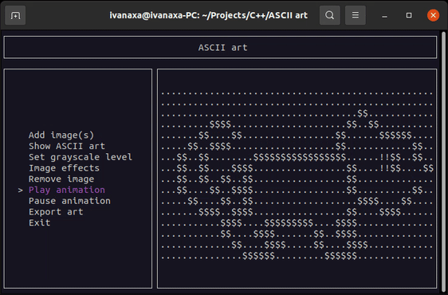

<dl>
    <h1 align="center">
        
        <br><br>ASCII Art Terminal<br>
    </h1>
    <p align="center">
        <a href="#key-features-">Key Features 🍪</a> |
        <a href="#dependencies-">Dependencies 🧬</a> |
        <a href="#build-">Build 🚀</a> |
        <a href="#how-to-use-">How to Use 📃</a> |
        <a href="#credits-">Credits ✍</a>
    </p>
    <h1 align="center">
        
    </h1>
</dl>

## Key Features 🍪

* User interface in terminal!
* Supports JPEG, PPM image formats
* Your own ASCII art symbol style!
* Preserve an image's aspect ratio
* ASCII art animation
* Export art to .txt file in full image resolution
* Supporting art effects:
    - _Contrast_
    - _Negative_
    - _Sharpen_

## Requirements 🧬

* C++ 14
* libncurses
* libjpeg

## Build 🚀

#### Install dependencies

Run this command to install all necessary dependencies:

```bash
$ sudo apt install libncurses-dev libjpeg-dev
```

#### Run application

Use this command to build and run ASCII Art Terminal:

```bash
$ make all
```

#### Generate documentation (optional)

Use this command to generate a documentation:

```bash
$ make doc
```

#### Clean build (optional)

Use this command to clean compiled binaries:

```bash
$ make clean
```

## How to Use 📃

#### Basics

1) [Build and run](#build-) application
2) Press the _menu_ button in the toolbar to open image list drawer
3) Press the _Add image_ button to add image
4) In popup dialog:
    - Fill the _Art name_ box **(required)**
    - Choose a path to image from file browser via _Browse_ button **(required)**
    - Choose effects to apply on your art _(optional)_
5) Press the _Add_ button and wait for the image to convert
6) **Enjoy** your ASCII art!

#### Image properties

* To edit your image (change art name or apply new effects):
    1) Press the three dots below the needed image
    2) Click on _Properties_ button
    3) Apply your changes
    4) Press the _Save_ button and wait for the image to re-convert
* To remove image from list:
    1) Press the three dots below the needed image
    2) Press the _Remove image_ button
* To export image to _.txt_ file:
    1) Press the three dots below the needed image
    2) Press the _Export to text file_ button
    3) Create new text file from opened file browser

#### Animation

* To enable this function you need to add **at least 2 images**
* Animation controls:
    1) Click on _Play animation_ button in a toolbar to start animation
    2) Click on _Stop animation_ button in a toolbar to stop animation

#### Settings

1) Press the three dots in toolbar
2) Press _Settings_ button

#### Optional utils

* **Adjust ASCII art size** by slider in toolbar
* Switch between **Light and Dark** theme in [Settings](#Settings) in _Theme_ section
* **Adjust animation duration** by slider in [Settings](#Settings) in _Animation duration_ section
* **Style ASCII art** with your own symbols in [Settings](#Settings) in _Grayscale level_ section:
    - You need to enter the sequence of symbols from darkest to lightest
    - Your ASCII art will be shown by these symbols

## Credits ✍

#### Third-party libraries

* [ncurses](https://invisible-island.net/ncurses/announce.html)
* [libjpeg](http://libjpeg.sourceforge.net/)

#### Used algorithms

* If you are interested in program's idea, read [zadani.txt](https://github.com/menshiva/ascii-art-terminal/blob/master/zadani.txt) (**WARNING: Czech language only**)
* [Image scaling algorithm](https://en.wikipedia.org/wiki/Image_scaling#Nearest-neighbor_interpolation)
* [RGB to Grayscale algorithm](https://en.wikipedia.org/wiki/Grayscale#Colorimetric_(perceptual_luminance-preserving)_conversion_to_grayscale)
* [Contrast algorithm](https://en.wikipedia.org/wiki/Contrast_(vision))
* [Convolution algorithm](https://setosa.io/ev/image-kernels/)
* [JPEG decompression example](https://github.com/LuaDist/libjpeg/blob/master/example.c#L210)

#### Author

* Ivan Menshikov (menshiva@fit.cvut.cz)

#### License

```
Copyright 2021 Ivan Menshikov

Licensed under the Apache License, Version 2.0 (the "License");
you may not use this file except in compliance with the License.
You may obtain a copy of the License at

   http://www.apache.org/licenses/LICENSE-2.0

Unless required by applicable law or agreed to in writing, software
distributed under the License is distributed on an "AS IS" BASIS,
WITHOUT WARRANTIES OR CONDITIONS OF ANY KIND, either express or implied.
See the License for the specific language governing permissions and
limitations under the License.
```
